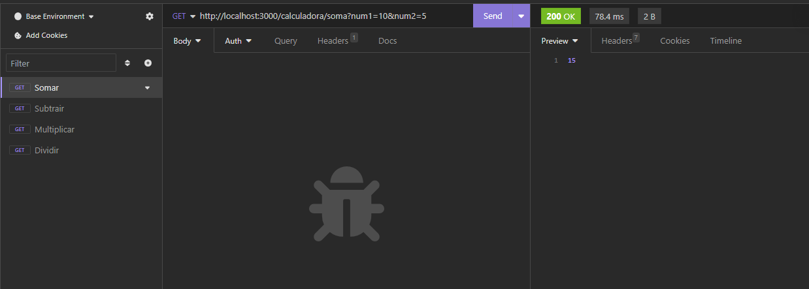
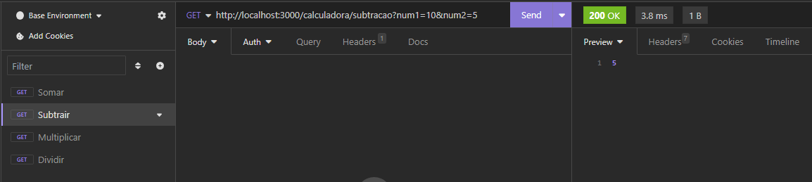
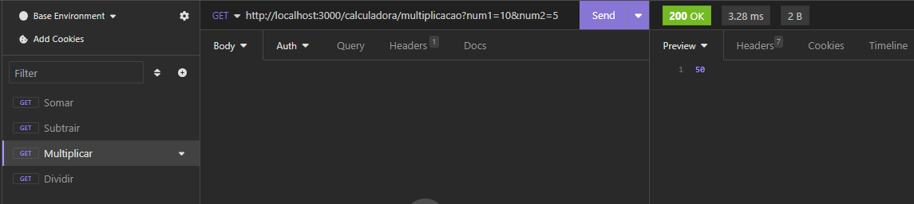
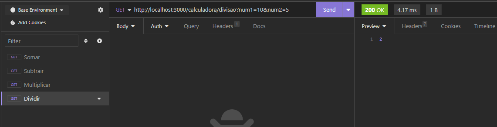

## Projeto Calculadora
### DESCRIÇÃO DO PROJETO:
É uma aplicação que possibilita realizar operaçoes de somar, subtrair, multiplicar e dividir números
## REQUISITOS:
1-	Node e npm
2-	VsCode
## COMO RODAR NA SUA MÁQUINA:
1-	Baixar ou clonar o projeto:  ;
2-	Abra o projeto no editor de codigos;
3-	Baixar as dependencias do projeto com “npm install”
4-	Execute o projeto com o seguinte comando:npm run dev
5-	Acessar em: http://localhost:3000
## EXECUTANDO OS TESTES:
Para a opreção de somar:  
http://localhost:3000/calculadora/soma?num1=10&num2=5  

Para a opreção de subtrair:  
http://localhost:3000/calculadora/subtracao?num1=10&num2=5  

Para a opreção de multiplicar:  
http://localhost:3000/calculadora/multiplicacao?num1=10&num2=5  

Para a opreção de dividir:  
http://localhost:3000/calculadora/divisao?num1=10&num2=5  

##### Obs.: você pode mudar os valores de "num1" e "num2" na URL para testar outros resultados.
## CONTRIBUIÇOES:
1-	Faça o FORK do projeto no canto superios direito da tela;  
2-	Clone o projeto do seu repositório no Gthub  
3-	Crie sua branch para poder realizar modificações  
4-	Ao terminar sua modificações, faça um commit : git commit –m  
5-	Realize o Push para seu repositório : git push  
6-	No seu repositório no Github faça uma PR(Pull request)  
